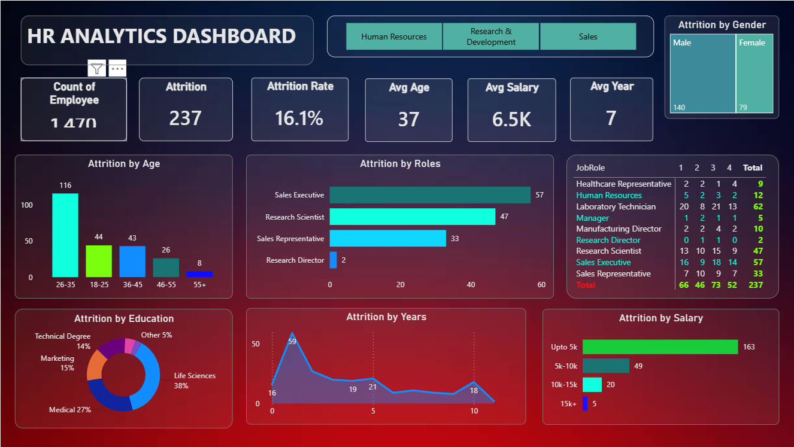

# HR Analytics Dashboard | Power BI



## Project Overview

This project is a self-driven HR Analytics project developed using Microsoft Power BI. The purpose of the project was to explore employee data, identify patterns in employee attrition, and present the findings through an interactive and visually intuitive dashboard.

The analysis focuses on employee characteristics such as age, gender, education, salary, job role, department, job satisfaction, and years spent at the company.

The project was created as a practical exercise in data analysis and visualization, with a focus on transforming raw HR data into meaningful business insights.

---

## Project Objective

The primary objective of this project was to understand employee attrition patterns and explore workforce characteristics associated with employee turnover.

The dashboard was designed to answer questions such as:

- How many employees are represented in the dataset?
- What is the overall attrition rate?
- Which age groups have higher attrition?
- Which job roles experience higher employee turnover?
- How does attrition vary across salary ranges?
- Does attrition differ by gender?
- Which educational backgrounds account for a larger share of attrition?
- How does attrition vary with employee tenure?
- How do HR metrics change across departments?

---

## Dashboard Overview

The dashboard provides an interactive view of key HR metrics and employee attrition patterns.

### Key Performance Indicators

| Metric | Value |
|---|---:|
| Total Employees | 1,470 |
| Attrition Count | 237 |
| Attrition Rate | 16.1% |
| Average Age | 37 Years |
| Average Salary | 6.5K |
| Average Years at Company | 7 Years |

---

## Key Analysis Areas

### Employee Attrition

The dashboard provides an overall view of employee attrition through the total attrition count and attrition rate.

### Attrition by Age

Employees are grouped into different age categories to identify the age groups where attrition is more concentrated.

The **26–35 age group** has the highest number of observed attrition cases.

### Attrition by Job Role

Attrition is analyzed across different job roles to identify roles with comparatively higher employee exits.

Among the displayed roles, **Sales Executive** records the highest attrition count.

### Attrition by Salary

Employees are grouped into salary ranges to understand the distribution of attrition across different salary levels.

The **Up to 5K** salary range represents the largest number of observed attrition cases.

### Attrition by Gender

The dashboard compares attrition cases between male and female employees.

The displayed data shows a higher number of attrition cases among male employees.

### Attrition by Education

The dashboard analyzes attrition across different educational backgrounds, including:

- Life Sciences
- Medical
- Marketing
- Technical Degree
- Other

Life Sciences represents the largest category in the displayed education-based attrition analysis.

### Attrition by Years at Company

The dashboard examines how employee attrition varies across different levels of organizational tenure.

This helps identify periods of an employee's tenure where attrition appears to be more concentrated.

### Department Analysis

The department filter allows the dashboard to be explored across different departments, including:

- Human Resources
- Research & Development
- Sales

This provides a more focused view of workforce metrics and attrition patterns.

---

## Key Insights

Some of the major observations from the analysis include:

1. The overall attrition rate in the dataset is **16.1%**.
2. Employees in the **26–35 age group** account for the highest number of observed attrition cases.
3. **Sales Executives** have the highest attrition count among the displayed job roles.
4. The **Up to 5K salary range** contains the largest number of attrition cases.
5. Male employees account for a higher number of observed attrition cases than female employees.
6. **Life Sciences** represents the largest education category in the displayed attrition analysis.
7. Attrition varies across different stages of employee tenure.
8. Department-level filtering allows workforce patterns to be explored in greater detail.

These observations represent patterns identified within the available dataset and should not be interpreted as proof of direct causes of employee attrition.

---

## Tools & Skills

### Tools

- Microsoft Power BI

### Skills Demonstrated

- Data Analysis
- Exploratory Data Analysis
- Data Visualization
- Dashboard Development
- KPI Analysis
- HR Analytics
- Business Insight Generation
- Interactive Reporting

---

## Dashboard Features

The dashboard includes:

- Employee Count
- Attrition Count
- Attrition Rate
- Average Age
- Average Salary
- Average Years at Company
- Attrition by Age
- Attrition by Gender
- Attrition by Education
- Attrition by Job Role
- Attrition by Salary
- Attrition by Years at Company
- Job Satisfaction Analysis
- Department Filtering

---

## Project Structure

```text
HR-Analytics-PowerBI/
│
├── README.md
│
├── HR_Analytics_Dashboard.pbix
│
├── Dashboard/
│   └── HR_Analytics_Dashboard.png
│
└── Documentation/
    ├── Project_Overview.md
    ├── Key_Insights.md
    └── Dashboard_Guide.md
